# 🛡️ Service Enumeration Cheat Sheets

<div align="center">


**🎯 Comprehensive penetration testing cheat sheets for service enumeration**

*Your go-to resource for systematic service discovery and exploitation*

</div>

---

## 📋 Table of Contents

<details>
<summary>🔍 Click to expand navigation</summary>

- [🚀 Quick Start](#-quick-start)
- [📊 Service Coverage](#-service-coverage)
- [💾 Database Services](#-database-services)
- [📧 Mail Services](#-mail-services)
- [🌐 Network Services](#-network-services)
- [🔧 File Services](#-file-services)
- [📖 Usage Guide](#-usage-guide)
- [🤝 Contributing](#-contributing)
- [📜 License](#-license)

</details>

---

## 🚀 Quick Start

```bash
# Clone the repository
git clone https://github.com/yourusername/service-enumeration.git
cd service-enumeration

# Quick reference for common services
ls -la *.md
```

<div align="center">

### 🎯 **Each cheat sheet includes:**
**Discovery** → **Enumeration** → **Authentication** → **Exploitation** → **Post-Exploitation**

</div>

---

## 📊 Service Coverage

<table align="center">
<tr>
<td align="center" width="25%">

### 💾 **Database Services**


</td>
<td align="center" width="25%">

### 📧 **Mail Services** 


</td>
<td align="center" width="25%">

### 🌐 **Network Services**


</td>
<td align="center" width="25%">

### 🔧 **File Services**


</td>
</tr>
</table>

---

## 💾 Database Services

<div align="center">

| Service | Port(s) | Cheat Sheet | Key Features |
|---------|---------|-------------|--------------|
| **🐬 MySQL** | `3306` | [📖 Guide](mysql.md) | Credential attacks, file operations, UDF exploitation |
| **🏢 MSSQL** | `1433` | [📖 Guide](mssql.md) | xp_cmdshell, Windows auth, database links |
| **🔮 Oracle TNS** | `1521` | [📖 Guide](oracle-tns.md) | SID enumeration, SYSDBA escalation, ODAT framework |

</div>

### 🎯 **Database Testing Highlights**

```bash
# MySQL Enumeration
nmap -p 3306 --script=mysql-* target
hydra -L users.txt -P passwords.txt mysql://target

# MSSQL Exploitation  
impacket-mssqlclient sa@target -windows-auth
EXEC xp_cmdshell 'whoami'

# Oracle TNS Discovery
./odat.py all -s target -d XE -U scott -P tiger
sqlplus scott/tiger@target:1521/XE as sysdba
```

---

## 📧 Mail Services

<div align="center">

| Service | Port(s) | Cheat Sheet | Key Features |
|---------|---------|-------------|--------------|
| **📮 SMTP** | `25,465,587` | [📖 Guide](smtp.md) | User enumeration, open relay, auth bypass |
| **📬 IMAP/POP3** | `143,993,110,995` | [📖 Guide](imap-pop3.md) | Email access, credential attacks, SSL testing |

</div>

### 🎯 **Mail Testing Highlights**

```bash
# SMTP User Enumeration
echo "VRFY admin" | nc target 25
smtp-user-enum -M VRFY -U users.txt -t target

# IMAP/POP3 Brute Force
hydra -L users.txt -P passwords.txt imap://target
curl -k 'imaps://target' --user user:pass
```

---

## 🌐 Network Services

<div align="center">

| Service | Port(s) | Cheat Sheet | Key Features |
|---------|---------|-------------|--------------|
| **🔍 SNMP** | `161,162` | [📖 Guide](snmp.md) | Community strings, MIB walking, Windows enumeration |

</div>

### 🎯 **Network Testing Highlights**

```bash
# SNMP Enumeration
onesixtyone -c community.txt target
snmpwalk -c public -v1 target 1.3.6.1.4.1.77.1.2.25
snmp-check target -c public
```

---

## 🔧 File Services

<div align="center">

| Service | Port(s) | Cheat Sheet | Key Features |
|---------|---------|-------------|--------------|
| **🗂️ SMB** | `445,139` | [📖 Guide](smb.md) | Share enumeration, null sessions, RID cycling |
| **📁 NFS** | `2049,111` | [📖 Guide](nfs.md) | Mount operations, UID manipulation, no_root_squash |

</div>

### 🎯 **File Service Testing Highlights**

```bash
# SMB Exploitation
smbclient -L -N //target
netexec smb target --shares -u guest -p ''
netexec smb target -u guest -p '' --rid-brute

# NFS Exploitation  
showmount -e target
mount -t nfs target:/share /mnt/nfs -o nolock
```

---

## 📖 Usage Guide

<details>
<summary>🔍 <strong>Click to expand usage instructions</strong></summary>

### 🎯 **Getting Started**

1. **Choose Your Target Service**
   ```bash
   nmap -sV -p- target
   ```

2. **Select Appropriate Cheat Sheet**
   - Each guide follows the same structure for consistency
   - Copy-paste ready commands for immediate use

3. **Follow The Methodology**
   ```
   Discovery → Enumeration → Authentication → Exploitation → Post-Exploitation
   ```

### 🛠️ **Command Structure**

All cheat sheets follow this format:
- **🔍 Discovery**: Port scanning and service detection
- **📋 Enumeration**: Information gathering and reconnaissance  
- **🔐 Authentication**: Credential attacks and testing
- **💥 Exploitation**: Attack execution and access gaining
- **🎯 Post-Exploitation**: Persistence and lateral movement

### 📚 **Quick Reference Cards**

Each guide includes:
- ✅ **Testing Checklist** - Systematic assessment approach
- 🚨 **Critical Vulnerabilities** - High-impact security issues
- ⚡ **Quick Commands** - Essential one-liners
- 🎯 **Default Credentials** - Common authentication bypasses

</details>

---

## 🎨 Visual Features

<div align="center">

### 🌙 **Dark Mode Optimized**
```
Designed for comfortable late-night penetration testing sessions
High contrast syntax highlighting for easy command identification
```

### 📱 **Mobile Friendly**
```
Responsive design works perfectly on mobile devices
Quick reference format for field testing
```

### 🔍 **Search Optimized**
```
Comprehensive table of contents in every guide
Keyword-rich headers for quick navigation
```

</div>

---

## 🏆 Why Choose These Cheat Sheets?

<table>
<tr>
<td align="center" width="25%">

### ⚡ **Battle-Tested**
```
Used in real penetration tests
Proven exploitation techniques
Updated with latest methods
```

</td>
<td align="center" width="25%">

### 🎯 **Practical Focus**
```
Copy-paste ready commands
No theory, just actionable steps
Organized by attack progression
```

</td>
<td align="center" width="25%">

### 📚 **Comprehensive**
```
Complete testing methodology
From discovery to exploitation
Includes post-exploitation
```

</td>
<td align="center" width="25%">

### 🔄 **Regularly Updated**
```
Latest tools and techniques
Current vulnerability research
Community contributions
```

</td>
</tr>
</table>

---

## 🛡️ Penetration Testing Methodology

```mermaid
graph LR
    A[🔍 Discovery] --> B[📋 Enumeration]
    B --> C[🔐 Authentication]
    C --> D[💥 Exploitation]
    D --> E[🎯 Post-Exploitation]
    
    style A fill:#ff6b6b,stroke:#fff,color:#fff
    style B fill:#4ecdc4,stroke:#fff,color:#fff
    style C fill:#45b7d1,stroke:#fff,color:#fff
    style D fill:#96ceb4,stroke:#fff,color:#fff
    style E fill:#feca57,stroke:#fff,color:#000
```

<div align="center">



**Each cheat sheet follows this proven methodology for consistent, thorough testing**

</div>

---

## 🤝 Contributing

<div align="center">

**Help make these cheat sheets even better!**

</div>

### 🎯 **How to Contribute**

1. **🍴 Fork the repository**
2. **🌿 Create a feature branch**
   ```bash
   git checkout -b feature/amazing-technique
   ```
3. **✨ Add your improvements**
   - New exploitation techniques
   - Additional tools and commands
   - Updated vulnerability information
4. **📝 Commit your changes**
   ```bash
   git commit -m "Add amazing new technique for SMB"
   ```
5. **🚀 Push and create a Pull Request**

### 💡 **Contribution Ideas**

- 🔧 **New Tools**: Add cutting-edge enumeration tools
- 🎯 **Techniques**: Share novel exploitation methods  
- 📚 **Documentation**: Improve clarity and examples
- 🐛 **Bug Fixes**: Correct errors and outdated information
- 🌟 **Examples**: Add real-world testing scenarios

---

## ⭐ Show Your Support

<div align="center">

**If these cheat sheets helped you in your penetration testing journey, please consider:**

[](https://github.com/yourusername/service-enumeration/stargazers)
[](https://github.com/yourusername/service-enumeration/network)

**⭐ Star this repository** • **🍴 Fork for your own use** • **📢 Share with the community**

</div>

---

## 📜 License

<div align="center">

```
MIT License - Use freely for educational and professional purposes
Attribution appreciated but not required
```

[](https://opensource.org/licenses/MIT)

</div>

---

## 🔗 Connect & Follow

<div align="center">

### 🌐 **Stay Updated**

Follow for the latest updates and new cheat sheets:

[](https://twitter.com/yourusername)
[](https://linkedin.com/in/yourusername)

</div>

---

<div align="center">

### 🎯 **Made with ❤️ for the cybersecurity community**

**Happy Hacking! 🏴‍☠️**

---

*These cheat sheets are for educational and authorized testing purposes only. Always ensure you have proper permission before testing any systems.*

</div>
