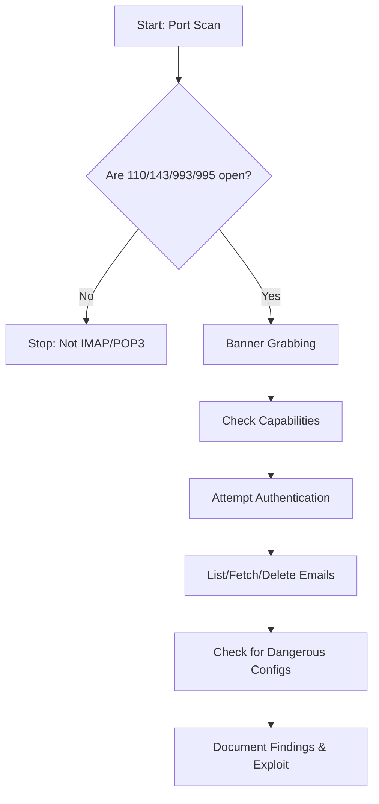

```markdown:service-enumeration/imapop3.md
# IMAP & POP3 Enumeration

---

## 1. Ports & Protocols

| Port | Protocol | Description                                  |
|------|----------|----------------------------------------------|
| 110  | TCP      | POP3 (Post Office Protocol v3)               |
| 995  | TCP      | POP3S (POP3 over SSL/TLS)                    |
| 143  | TCP      | IMAP (Internet Message Access Protocol)      |
| 993  | TCP      | IMAPS (IMAP over SSL/TLS)                    |

- **IMAP**: Online management of emails, supports folders, multiple clients, and server-side storage.
- **POP3**: Simple retrieval and deletion of emails, limited server-side management.

---

## 2. IMAP & POP3 Features

| Feature         | IMAP                                   | POP3                        |
|-----------------|----------------------------------------|-----------------------------|
| Server Folders  | Yes                                    | No                          |
| Multiple Clients| Yes (syncs across devices)             | No (download/delete only)   |
| Server Storage  | Yes (until deleted)                    | No (usually downloads only) |
| Commands        | Rich (browse, fetch, create, delete)   | Simple (list, retr, dele)   |
| Default Port    | 143 (993 SSL)                          | 110 (995 SSL)               |

- **IMAP** allows for advanced mailbox management and is stateful.
- **POP3** is stateless and designed for simple download-and-delete workflows.

---

## 3. IMAP & POP3 Commands

### IMAP Commands

| Command                | Description                                      |
|------------------------|--------------------------------------------------|
| LOGIN user pass        | User login                                       |
| LIST "" *              | List all mailboxes                               |
| CREATE "INBOX"         | Create a mailbox                                 |
| DELETE "INBOX"         | Delete a mailbox                                 |
| RENAME "A" "B"         | Rename a mailbox                                 |
| LSUB "" *              | List subscribed mailboxes                        |
| SELECT INBOX           | Select mailbox for access                        |
| UNSELECT INBOX         | Exit selected mailbox                            |
| FETCH <ID> all         | Retrieve message data                            |
| CLOSE                  | Remove messages marked for deletion              |
| LOGOUT                 | Close connection                                 |

### POP3 Commands

| Command        | Description                                  |
|----------------|----------------------------------------------|
| USER username  | Identify user                                |
| PASS password  | Authenticate user                            |
| STAT           | Number of messages                           |
| LIST           | List messages and sizes                      |
| RETR id        | Retrieve message by ID                       |
| DELE id        | Delete message by ID                         |
| CAPA           | Show server capabilities                     |
| RSET           | Reset session                                |
| QUIT           | Close connection                             |

---

## 4. Scanning & Discovery

### Nmap

```bash
sudo nmap -sV -p110,143,993,995 -sC <target>
```
- Scans for IMAP/POP3 (plain and SSL), grabs banners, and runs default scripts.

---

## 5. Manual Enumeration Tools

### Netcat / Telnet

```bash
nc <target> 143
telnet <target> 110
```
- Interact with IMAP/POP3 using plaintext commands.

### OpenSSL

```bash
openssl s_client -connect <target>:993   # IMAPS
openssl s_client -connect <target>:995   # POP3S
```
- Interact with encrypted IMAP/POP3.

### cURL

```bash
curl -k 'imaps://<target>' --user user:pass
curl -k 'pop3s://<target>' --user user:pass
```
- Authenticate and list mailboxes/messages.

---

## 6. IMAP/POP3 Server Config & Security

- **Unencrypted by default**: Credentials and emails sent in plaintext unless SSL/TLS is used.
- **Dangerous Settings**:
  - `auth_debug`, `auth_debug_passwords`, `auth_verbose`, `auth_verbose_passwords`: May log sensitive info.
  - `auth_anonymous_username`: Allows anonymous logins.
- **Mitigations**:
  - Enforce SSL/TLS (ports 993/995).
  - Disable plaintext authentication.
  - Restrict debug and verbose logging in production.
  - Disable anonymous access.

---

## 7. Typical Enumeration Flow

### Flowchart



### Step-by-Step Attack/Enumeration Flow

1. **Port Scan:**  
   - Identify if 110, 143, 993, or 995 are open.

2. **Banner Grabbing:**  
   - Use Netcat, Telnet, or OpenSSL to read the service banner.

3. **Check Capabilities:**  
   - Use Nmap, cURL, or manual commands to enumerate supported features.

4. **Attempt Authentication:**  
   - Try known or guessed credentials (e.g., user:user).

5. **List/Fetch/Delete Emails:**  
   - Use IMAP/POP3 commands to interact with mailboxes.

6. **Check for Dangerous Configurations:**  
   - Look for debug/verbose logging, anonymous access, or weak SSL.

7. **Document Findings & Exploit:**  
   - Save all output, note valid credentials, misconfigurations, and possible exploits.

---

## 8. Useful Tools

| Tool         | Use Case                | Command Example                        |
|--------------|------------------------|----------------------------------------|
| nmap         | Port/service scan       | nmap -sV -p110,143,993,995 <target>    |
| nc/telnet    | Manual interaction      | nc <target> 143                        |
| openssl      | Encrypted interaction   | openssl s_client -connect <target>:993 |
| curl         | Scripted interaction    | curl -k 'imaps://<target>' --user u:p  |

---

## 9. Key Points to Remember

- **IMAP** is more feature-rich than POP3.
- **Always use SSL/TLS** for secure communication.
- **Credentials and emails** are exposed in plaintext if not encrypted.
- **Misconfigurations** can allow unauthorized access or information leakage.
- **Document** all findings for reporting and exploitation.

---

**Tip:**  
Always save your enumeration output for later review and evidence.  
Use `-oN`/`-oG`/`-oA` with nmap, and redirect tool output to files.

---

*This cheat sheet is designed for fast, effective IMAP/POP3 enumeration and exploitation in a pentest/OSCP context.*
