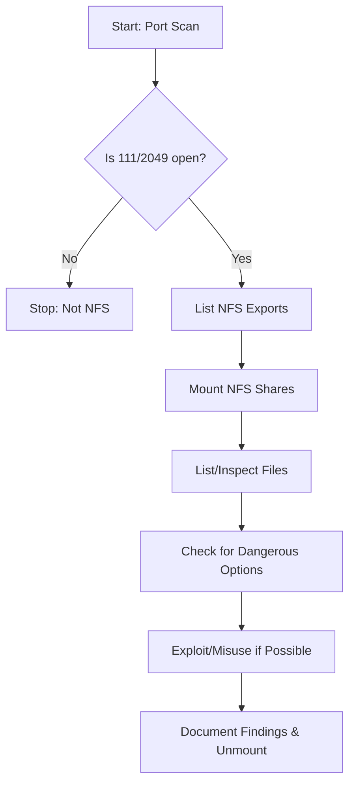

# NFS Enumeration

---

## 1. Ports & Protocols

| Port   | Protocol | Description                                  |
|--------|----------|----------------------------------------------|
| 111    | TCP/UDP  | RPCbind/Portmapper (ONC-RPC/SUN-RPC)         |
| 2049   | TCP/UDP  | NFS (Network File System)                    |

- **NFS** allows remote file system access as if local, mainly between Linux/Unix systems.
- **NFSv4** uses only port 2049, simplifying firewall rules.

---

## 2. NFS Versions & Features

| Version | Features                                                                                  |
|---------|-------------------------------------------------------------------------------------------|
| NFSv2   | Old, widely supported, UDP only                                                           |
| NFSv3   | Variable file size, better error reporting, not fully compatible with v2, UDP/TCP         |
| NFSv4   | Kerberos auth, works through firewalls, supports ACLs, stateful, only port 2049, secure   |
| NFSv4.1 | Cluster support, pNFS, session trunking (multipathing), performance/security improvements  |

- **NFSv3 and below**: Authenticates client machine, not user.
- **NFSv4**: User authentication (Kerberos), stateful, better security.

---

## 3. NFS Exports & Configuration

**Config file:** `/etc/exports`

| Option            | Description                                               |
|-------------------|----------------------------------------------------------|
| rw                | Read and write permissions                               |
| ro                | Read-only permissions                                    |
| sync/async        | Synchronous/Asynchronous data transfer                   |
| secure/insecure   | Use privileged/unprivileged ports                        |
| no_subtree_check  | Disables subtree checking                                |
| root_squash       | Maps root to anonymous user                              |
| no_root_squash    | Root keeps root privileges (dangerous)                   |
| nohide            | Exports mounted filesystems under exported dirs           |

**Example:**
```
/mnt/nfs 10.129.14.0/24(sync,no_subtree_check)
```

**Dangerous Settings:**
- `rw` (write access to all clients)
- `no_root_squash` (root on client = root on server)
- `insecure` (allows unprivileged ports)
- `nohide` (exposes all mounted filesystems)

---

## 4. Scanning & Discovery

### Nmap

```bash
sudo nmap -p111,2049 -sV -sC <target>
sudo nmap --script nfs* <target> -sV -p111,2049
```
- Scans for NFS and RPC services, runs NSE scripts for NFS shares and stats.

### showmount

```bash
showmount -e <target>
```
- Lists exported NFS shares.

---

## 5. Manual Enumeration & Mounting

### Mounting NFS Share

```bash
mkdir target-NFS
sudo mount -t nfs <target>:/mnt/nfs ./target-NFS/ -o nolock
cd target-NFS
ls -l
```
- Mounts the NFS share locally for inspection.

### Listing Contents

```bash
ls -l mnt/nfs/
ls -n mnt/nfs/
```
- Shows file owners by name and UID/GID.

### Unmounting

```bash
cd ..
sudo umount ./target-NFS
```

---

## 6. NFS Escalation & Exploitation

- **UID/GID Mapping:** If you control UID/GID on your machine, you may gain access to files as those users.
- **no_root_squash:** If set, root on client can create SUID binaries or access all files as root.
- **Writable Shares:** Can upload/modify files, plant backdoors, or escalate privileges.

---

## 7. Typical Enumeration Flow

### Flowchart



### Step-by-Step Attack/Enumeration Flow

1. **Port Scan:**  
   - Identify if 111/2049 are open.

2. **List NFS Exports:**  
   - Use `showmount -e <target>` to enumerate shares.

3. **Mount NFS Shares:**  
   - Mount shares locally for inspection.

4. **List/Inspect Files:**  
   - Check file permissions, owners, and contents.

5. **Check for Dangerous Options:**  
   - Look for `rw`, `no_root_squash`, `insecure`, etc.

6. **Exploit/Misuse if Possible:**  
   - Try privilege escalation, file upload, or SUID tricks.

7. **Document Findings & Unmount:**  
   - Save output, unmount shares, and report findings.

---

## 8. Useful Tools

| Tool         | Use Case                | Command Example                        |
|--------------|------------------------|----------------------------------------|
| nmap         | Port/service scan       | nmap -p111,2049 -sV -sC <target>       |
| showmount    | List NFS exports        | showmount -e <target>                  |
| mount        | Mount NFS share         | mount -t nfs <target>:/share ./mnt     |

---

## 9. Key Points to Remember

- **NFS is insecure by default**; use only on trusted networks.
- **UID/GID mapping** can be abused for privilege escalation.
- **no_root_squash** is highly dangerous.
- **Always unmount** after enumeration.
- **Document** all findings for reporting and exploitation.

---

**Tip:**  
Always save your enumeration output for later review and evidence.  
Use `-oN`/`-oG`/`-oA` with nmap, and redirect tool output to files.

---

*This cheat sheet is designed for fast, effective NFS enumeration and exploitation in a pentest/OSCP context.*