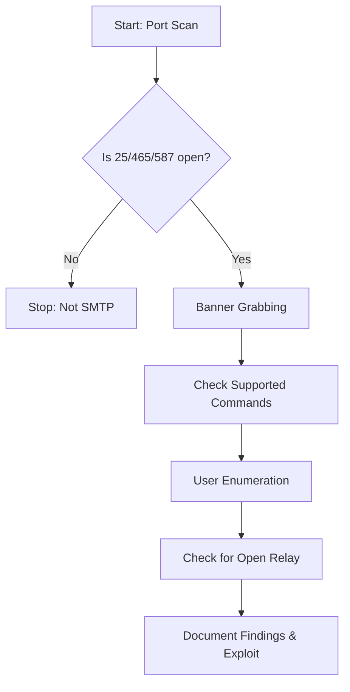

# SMTP Enumeration

---

## 1. Ports & Protocols

| Port | Protocol | Description                |
|------|----------|---------------------------|
| 25   | TCP      | SMTP (Simple Mail Transfer Protocol) |
| 465  | TCP      | SMTPS (SMTP over SSL)     |
| 587  | TCP      | SMTP (Submission, STARTTLS) |

- **SMTP** is used for sending email between servers and from clients to servers.
- **Enumeration** can reveal valid users, server software, and misconfigurations.

---

## 2. SMTP Commands & Responses

| Command | Description                                 | Typical Use/Response Example                |
|---------|---------------------------------------------|---------------------------------------------|
| HELO/EHLO | Identify client to server                 | 250 Hello                                  |
| VRFY    | Verify if a user exists                     | 250/252 (exists), 550 (not found)          |
| EXPN    | Expand a mailing list                       | 250 (list), 550 (not found)                |
| RCPT TO | Specify recipient (can be used for enum)    | 250 (accepted), 550 (not found)            |
| MAIL FROM | Specify sender                            | 250 OK                                     |
| HELP    | List supported commands                     | 214 Help message                           |

**Common Response Codes:**
- `220` Service ready
- `250` Requested mail action okay, completed
- `252` Cannot VRFY user, but will accept message
- `550` Requested action not taken: mailbox unavailable

---

## 3. Scanning & Discovery

### Nmap

```bash
nmap -p 25,465,587 -sV --script smtp-enum-users,smtp-commands <target>
```
- `smtp-enum-users`: Attempts to enumerate valid users.
- `smtp-commands`: Lists supported SMTP commands.

### Netcat

```bash
nc -nv <target> 25
```
- Manual interaction with SMTP service.

---

## 4. Manual Enumeration Tools

### Netcat (Linux)

```bash
nc -nv <target> 25
```
- Example:
  ```
  VRFY root
  VRFY johndoe
  ```

### Telnet (Windows/Linux)

```cmd
telnet <target> 25
```
- Example:
  ```
  VRFY root
  ```

### PowerShell

```powershell
Test-NetConnection -Port 25 <target>
```
- Checks if port 25 is open.

### Python Script

```python
import socket
import sys

if len(sys.argv) != 3:
    print("Usage: vrfy.py <username> <target_ip>")
    sys.exit(0)

s = socket.socket(socket.AF_INET, socket.SOCK_STREAM)
ip = sys.argv[2]
s.connect((ip,25))
banner = s.recv(1024)
print(banner)
user = (sys.argv[1]).encode()
s.send(b'VRFY ' + user + b'\r\n')
result = s.recv(1024)
print(result)
s.close()
```
- Usage: `python3 vrfy.py root <target_ip>`

---

## 5. SMTP Server Config & Security

- **Banner Grabbing:** Reveals server software/version.
- **User Enumeration:** VRFY/EXPN/RCPT TO can reveal valid users.
- **Misconfigurations:** Open relay, weak authentication, verbose errors.

**Mitigations:**
- Disable VRFY/EXPN if not needed.
- Restrict RCPT TO responses.
- Hide software version in banner.
- Require authentication for mail submission.

---

## 6. Typical Enumeration Flow

### Flowchart



### Step-by-Step Attack/Enumeration Flow

1. **Port Scan:**  
   - Identify if 25, 465, or 587 are open.

2. **Banner Grabbing:**  
   - Connect via Netcat/Telnet to read the SMTP banner.

3. **Check Supported Commands:**  
   - Use `EHLO`, `HELP`, or Nmap scripts to list commands.

4. **User Enumeration:**  
   - Use `VRFY`, `EXPN`, or `RCPT TO` to enumerate users.

5. **Check for Open Relay:**  
   - Attempt to send mail from external to external address.

6. **Document Findings & Exploit:**  
   - Save output, note valid users, misconfigurations, and possible exploits.

---

## 7. Useful Tools

| Tool         | Use Case                | Command Example                        |
|--------------|------------------------|----------------------------------------|
| nmap         | Port/service scan       | nmap -p25,465,587 -sV <target>         |
| nc (netcat)  | Manual SMTP interaction | nc -nv <target> 25                     |
| telnet       | Manual SMTP interaction | telnet <target> 25                     |
| smtp-user-enum | User enumeration      | smtp-user-enum -M VRFY -U users.txt -t <target> |
| Python       | Scripted VRFY           | python3 vrfy.py root <target_ip>       |

---

## 8. Key Points to Remember

- **VRFY/EXPN/RCPT TO** can reveal valid users if not disabled.
- **Banner** may leak software/version.
- **Open relay** is a critical misconfiguration.
- **Automate** with scripts, but always verify manually.
- **Document** all findings for reporting and exploitation.

---

**Tip:**  
Always save your enumeration output for later review and evidence.  
Use `-oN`/`-oG`/`-oA` with nmap, and redirect tool output to files.

---

*This cheat sheet is designed for fast, effective SMTP enumeration and exploitation in a pentest/OSCP context.*
