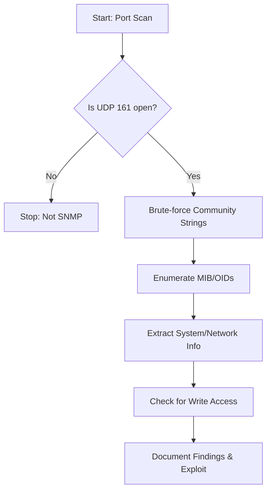

# SNMP Enumeration

---

## 1. Ports & Protocols

| Port | Protocol | Description                                  |
|------|----------|----------------------------------------------|
| 161  | UDP      | SNMP (Simple Network Management Protocol)    |
| 162  | UDP      | SNMP Trap (asynchronous notifications)       |

- **SNMP** is used for monitoring and managing network devices (routers, switches, servers, IoT, etc.).
- **SNMP Traps** (UDP 162) are alerts sent from agents to managers.

---

## 2. SNMP Versions & Security

| Version  | Security Features         | Notes                                                      |
|----------|--------------------------|------------------------------------------------------------|
| SNMPv1   | None                     | No encryption, no authentication, plaintext community      |
| SNMPv2c  | None                     | Same as v1, adds bulk requests, plaintext community        |
| SNMPv3   | Auth & Encryption        | Supports authentication (user/pass) and encryption (AES/3DES), but can be complex to configure |

- **Community Strings**: Act as passwords ("public" = read-only, "private" = read-write by default).
- **Default strings** are often left unchanged, leading to easy compromise.
- **SNMPv3** is more secure but less commonly deployed due to complexity.

---

## 3. SNMP MIB, OID, and Data

- **MIB (Management Information Base):** Hierarchical database of network objects/devices, described in text files.
- **OID (Object Identifier):** Numeric address for each MIB object (e.g., `1.3.6.1.2.1.25.1.6.0` for System Processes).
- **Common OIDs for Windows:**

| OID                        | Description         |
|----------------------------|--------------------|
| 1.3.6.1.2.1.25.1.6.0       | System Processes   |
| 1.3.6.1.2.1.25.4.2.1.2     | Running Programs   |
| 1.3.6.1.2.1.25.4.2.1.4     | Processes Path     |
| 1.3.6.1.2.1.25.2.3.1.4     | Storage Units      |
| 1.3.6.1.2.1.25.6.3.1.2     | Software Name      |
| 1.3.6.1.4.1.77.1.2.25      | User Accounts      |
| 1.3.6.1.2.1.6.13.1.3       | TCP Local Ports    |

---

## 4. Scanning & Discovery

### Nmap

```bash
sudo nmap -sU --open -p 161 <target-range> -oG open-snmp.txt
```
- Scans for open SNMP ports (UDP 161).

### onesixtyone

```bash
onesixtyone -c community.txt -i ips.txt
```
- Brute-forces SNMP community strings across IPs.

---

## 5. Manual Enumeration Tools

### snmpwalk

```bash
snmpwalk -c public -v1 <target>
snmpwalk -c public -v1 <target> <OID>
```
- Enumerates the entire MIB tree or a specific OID branch.

### onesixtyone

```bash
onesixtyone -c <community-list> <target>
```
- Brute-forces community strings.

### braa

```bash
braa public@<target>:.1.3.6.*
```
- Brute-forces OIDs for information.

---

## 6. SNMP Daemon Config & Security

**Config file:** `/etc/snmp/snmpd.conf`

| Setting                | Description                                      |
|------------------------|--------------------------------------------------|
| sysLocation            | Device location                                  |
| sysContact             | Admin contact                                    |
| sysServices            | Service type                                     |
| agentaddress           | Listening IP/port                                |
| rocommunity            | Read-only community string                       |
| rwcommunity            | Read-write community string                      |
| rouser                 | SNMPv3 user                                      |

**Dangerous Settings:**
- `rwcommunity <community> <IP>`: Full write access from any IP.
- `rwuser noauth`: Full access without authentication.

**Mitigations:**
- Use SNMPv3 with strong auth and encryption.
- Restrict community strings and allowed IPs.
- Change default community strings.
- Limit OID views.

---

## 7. Typical Enumeration Flow

### Flowchart



### Step-by-Step Attack/Enumeration Flow

1. **Port Scan:**  
   - Identify if UDP 161 is open.

2. **Brute-force Community Strings:**  
   - Use `onesixtyone` or wordlists to find valid community strings.

3. **Enumerate MIB/OIDs:**  
   - Use `snmpwalk`, `snmpget`, or `braa` to enumerate system info, users, processes, software, open ports, etc.

4. **Extract System/Network Info:**  
   - Look for usernames, running processes, installed software, network config, open ports, etc.

5. **Check for Write Access:**  
   - If `private` or other RW community string is found, attempt to write/change config.

6. **Document Findings & Exploit:**  
   - Save all output, note valid strings, misconfigurations, and possible exploits.

---

## 8. Useful Tools

| Tool         | Use Case                | Command Example                        |
|--------------|------------------------|----------------------------------------|
| nmap         | Port/service scan       | nmap -sU -p161 <target>                |
| snmpwalk     | Enumerate MIB/OIDs      | snmpwalk -c public -v1 <target>        |
| snmpget      | Query specific OID      | snmpget -c public -v1 <target> <OID>   |
| onesixtyone  | Brute-force communities | onesixtyone -c community.txt <target>  |
| braa         | Brute-force OIDs        | braa public@<target>:.1.3.6.*          |

---

## 9. Key Points to Remember

- **SNMPv1/v2c** are insecure: plaintext, weak/no auth.
- **Community strings** are often left at defaults ("public"/"private").
- **MIB/OID** enumeration can reveal users, processes, software, open ports, and more.
- **RW access** can allow device reconfiguration or compromise.
- **Always document** valid strings, OIDs, and findings.

---

**Tip:**  
Always save your enumeration output for later review and evidence.  
Use `-oN`/`-oG`/`-oA` with nmap, and redirect tool output to files.

---

*This cheat sheet is designed for fast, effective SNMP enumeration and exploitation in a pentest/OSCP context.*
